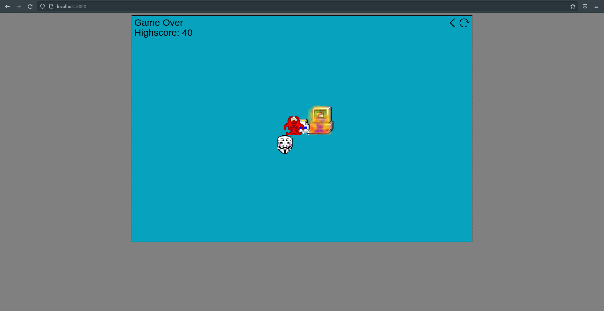

# Computer-IO



Computer-IO is about avoiding Hackers and Malwares

[Try it now](https://thegamedevdude.github.io/Computer-IO/)

### To build Dockerfile
```
docker build . -t computer-io:0.0.1 
```

### To run docker image
```
docker run -p 8000:8000 computer-io:0.0.1 
```

### To run the application
```
http://localhost:8000/
```

### Controls
| Action | Keys |
|--------|------|
|Move Forward|<KBD>W</KBD>|
|Move Backwards|<KBD>S</KBD>|
|Strafe Left|<KBD>A</KBD>|
|Strafe Right|<KBD>D</KBD>|
